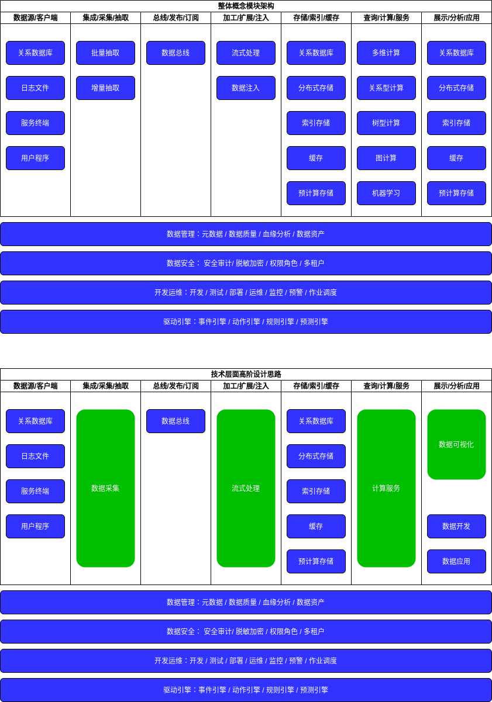

> “在线管道处理”（OLPP，Online Pipeline Processing）

== 概念模块&整体设计架构

=== 统一数据采集平台

统一数据采集平台，既可以支持不同数据源的全量抽取，也可以支持增强抽取。其中对于业务数据库的增量抽取会选择读取数据库日志，以减少业务库的读取压力。
平台还可以对抽取的数据进行统一处理，然后以统一格式发布到数据总线上。这里我们选择一种自定义的标准统一消息格式UMS（Unified Message Schema）
做为统一数据采集平台和统一流式处理平台之间的数据层面协议。

UMS自带Namespace信息和Schema信息，这是一种自定位自解析消息协议格式，这样做的好处是：

* 整个架构无需依赖外部元数据管理平台
* 消息和物理媒介解偶（这里屋里媒介值如Kafka的Topic，Spark Streaming的Stream等），因此可以通过物理媒介支持多消息流并行，和消息流的自由漂移。

平台也支持多租户体系，和配置化简单处理清洗能力。

=== 统一流式处理平台

统一流式处理平台，会消费来自数据总线上的消息，可以支持UMS协议消息，也可以支持普通JSON格式消息。同时，平台还支持一下能力：

* 支持可视化/配置化/SQL化方式降低流式逻辑开发 / 部署 / 管理门槛
* 支持配置化方式幂等落入多个异构目标库以确保数据的最终一致性
* 支持多租户体系，做到项目级的计算资源 / 表资源 / 用户资源等隔离

=== 统一计算服务平台

统一计算服务平台，是一种虚拟化 / 数据联邦的实现。平台对内支持多异构数据源的下推计算和拉取混算，也支持对外的统一服务接口（JDBC / REST）和统一查询语言（SQL）。
由于平台可以统一收口服务，因此可以基于平台打造统一元数据管理 / 数据质量管理 / 数据安全审计 / 数据安全策略等模块。平台也支持多租户体系。

=== 统一数据可视化平台

统一数据可视化平台，加上多租户和完善的用户体系/ 权限体系，可以支持跨部门数据从业人员的分工协作能力，让用户在可视化环境下，通过紧密合作的方式，更能发挥各自所长来完成
数据平台最后十公里的应用。
以上是基于整体模块架构之上，进行了统一抽象设计，并开发存储选项以提高灵活性和需求适配性。这样的RTDP平台设计，提现了现代数仓的实时性 / 虚拟化 / 平民化 / 协作化等能力，并且覆盖率端到端的OLPP数据流转链路。

== 具体问题和考量思路

=== 功能考量

内容来源：

. https://cloud.tencent.com/developer/article/1452482