= rCore

> 清华大学操作系统教材 rCore学习笔记

== 特色：

. 采用Rust实现
. 采用RISC-V架构

== 目标：

. 了解操作系统原理
. 系统学习如何正确使用并提高资源利用率（IO/Mem/CPU）

== 文件系统

=== VFS 虚拟文件系统层（Virtual File System）
> 确切的说扮演着文件系统管理者的角色，与它相关的数据结构只存在于物理内存当中。它的作用是：屏蔽下层具体文件系统操作的差异，为上层的操作提供一个统一的接口。正是因为有了这个层次，Linux中允许众多不同的文件系统共存并且对文件袋操作可以跨文件系统而执行。

Linux中VFS倚靠四个主要的数据结构来描述其结构信息，分别为超级块、索引结点、目录项和文件对象：

. 超级块（Super Block）: 超级快对象表示一个文件系统。它存储一个已完整的文件系统的控制信息，包括文件系统名称（比如Ext2）、文件系统的大小和状态、块设备的引用和元数据信息（比如空闲列表等等）。VFS超级块存在于内存中，它在文件系统安装时建立，并且文件系统卸载时自动删除。同时需要注意的是对于每个具体的文件系统来说，也有各自的超级块，它们存放于磁盘。

. 索引结点（Inode）：索引结点对象存储了文件的相关元数据信息，例如：文件大小、设备标识符、用户标识符、用户组标识符等等。Inode分为两种：一种是VFS的Inode，一种是具体文件系统的Inode。前者在内存中，后者在磁盘中。所以每次其实是将磁盘中的Inode填充内存中的Inode

. 目录项（Dentry）：引入目录项对象的概念主要是出于方便查找文件的目的。不同于前面的两个对象，目录项对象没有对应的磁盘数据结构，只存在于内存中。一个路径的各个组成部分，不管是目录还是普通的文件，都是一个目录项对象。VFS在查找的时候，根据一层一层的目录项找到对应的每个目录的Inode，那么沿着目录项进行操作就可以找到最终的文件。

. 文件对象（File）：文件对象描述的是进程已经打开的文件。因为一个文件可以被多个进程打开，所以一个文件可以存在多个文件对象。一个文件对应的文件对象可能不是唯一的，但是其对应的索引节点和目录项对象肯定是唯一的。

=== Ext2文件系统

=== Page Cache层

=== 通用块层

=== I/O调度层
> I/O 调度层的功能是管理块设备的请求队列。既接收通用块层发出的I/O请求。并根据设置好的调度算法，回调驱动层提供的请求处理函数，以处理具体的I/O请求。

常见的I/O调度算法包括Noop调度算法（No Operation）、CFQ（完全公正排队I/O调度算法）、DeadLine（截止时间调度算法）、AS预测调度算法等。

=== 块设备驱动层

驱动层中的驱动程序对应具体的物理块设备。它从上层中取出I/O请求，并根据该I/O请求中指定的信息，通过向具体块设备的设备控制器发送命令的方式，来操纵设备传输数据。

https://rcore-os.github.io/rCore-Tutorial-Book-v3/chapter0/index.html[教材]
https://tech.meituan.com/2017/05/19/about-desk-io.html[磁盘I/O那些事]