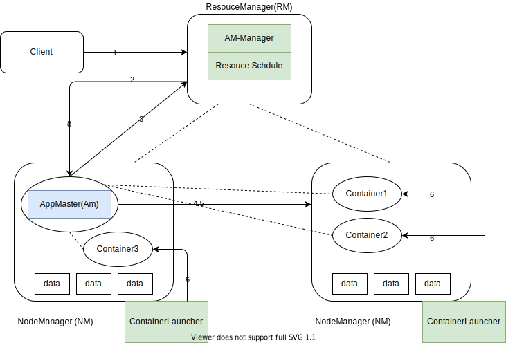

== 调度系统

=== yarn

. 有YarnClient提交program信息打拼ResourceManager，包括（应用代码和应用需要的一切参数和环境信息）

. ResourceManager收到请求之后，调用ApplicationMasterManager向NodeManager发送请求，申请一个资源（Container），并且要求Container启动ApplicationMaster.

. ApplicationMaster启动之后，首先注册自己到ResourceManager，然后为自己的Task申请Container，这个过程是轮训的，循环申请资源，ResourceManager收到请求之后，会要求NodeManager分配资源

. 资源分配完毕之后，Application Master发送请求到NodeManager，启动任务。

. NodeManager设置Container的运行时环境（jar包，环境变量，任务启动脚本），NodeManager会通过脚本启动任务

. 启动的过程是由NodeManager的ContainerLauncher负责的，ContainerLauncher完成启动任务的工作

. 这一步是在作业执行过程中持续发生的，我用虚线代表，主要包括两类交互，第一，task和Application Master的交互，task会向AM汇报任务状态和进度信息，比如任务启动，停止，状态更新。Applicaiton Master利用这些信息监控task整个执行过程。第二，是NodeManager和ResourceManager的交互，这个过程和任务没有关系，主要是两者之间保持的心跳信息（状态的变化等等）

. Application Master在检测到作业运行完毕之后，Application Master想Resource Manager 删除自己，并且停止自己执行。

图中浅绿色的部分是ResourceManager和NodeManager的组件主要负责控制整个流程；浅蓝色部分，核心资源分配流程，不属于是由具体的数据引擎实现的，由此可见Yarn采用资源双层调度模型，第一层Yarn分配资源（Container）给ApplicationMaster，这是由Yarn实现。第二层是由，ApplicationMaster分配资源给task，这是有具体工作引擎实现，这样的好处是将，yarn的调度和应用分隔开，便于yarn和应用实现、优化或升级自己的调度策略。

=== kubernetes

== 附录

* https://blog.csdn.net/sxiaobei/article/details/80875062[Yarn资源调度工作原理]
* https://m.sohu.com/a/397939464_683048[K8s和YARN都不够好，全面解析Facebook自研流处理服务管理平台]
* https://kubernetes.io/zh/docs/concepts/scheduling-eviction/kube-scheduler/[Kubernetes 调度器]