= api超市

> 提供从API设计、开发、管理、门户、网关等API全生命周期的产品。

== 目标

* Specs

Describe your services using the OpenAPI Specification format

* API Proxies

Route, transform,and secure your traffic through the API gateway

* API Products

Control how developers consume your APIs

* Portals

Publish APIs and reference docs, and on-board developers

== 概念

* API 货币化

== 附录

* https://github.com/spaceuptech/space-cloud[Open source Firebase + Heroku to develop, scale and secure serverless apps on Kubernetes]
* https://cloud.google.com/apigee/docs/api-platform/get-started/compare-apigee-products?hl=zh-cn[APIGee]
* https://github.com/OAI/OpenAPI-Specification[The OpenAPI Specification Repository]
* https://github.com/OpenAPITools/openapi-generator[OpenAPI Generator allows generation of API client libraries (SDK generation), server stubs, documentation and configuration automatically given an OpenAPI Spec (v2, v3)]
* https://github.com/wso2[wso2]