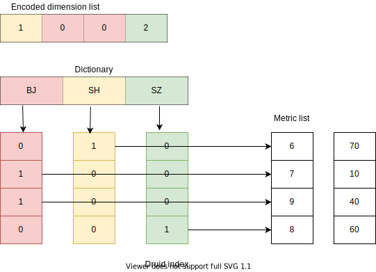

== Druid数据模型

Druid数据模型比较简单，它将数据进行预聚合，只不过预聚合的方式与Kylin不同，kylin是Cube化，Druid的预聚合方式是将所有维度进行Group-by

== Druid索引结构

Druid索引结构使用自定义的数据结构，整体上她是一种列式存储结构，每个列独立一个逻辑文件（实际上是一个物理文件，在物理文件内部标记了每个列的start和offset）。对于维度列设计了索引，它的索引以Bitmap为核心。

== Druid小结：

Druid适用于聚合查询场景但是不适合有超高基维度的场景；存储全维度group-by 后的数据，相当于只存储了Kylin Cube点Base-CuboID;每个维度都有创建索引，所以每个查询都很快，并且没有Kylin都巨大查询效率波动。